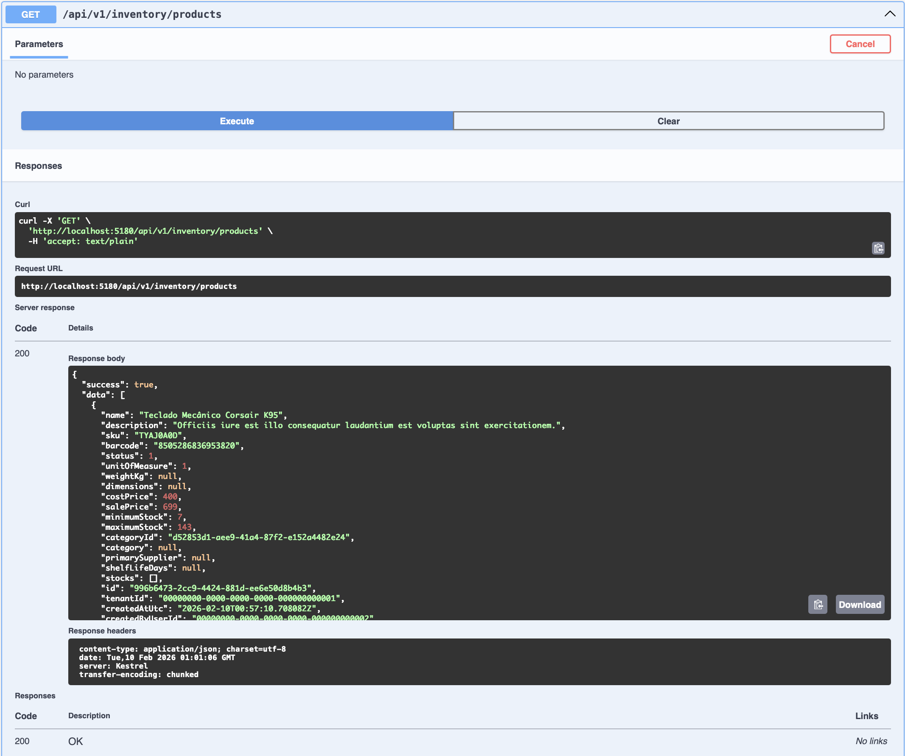
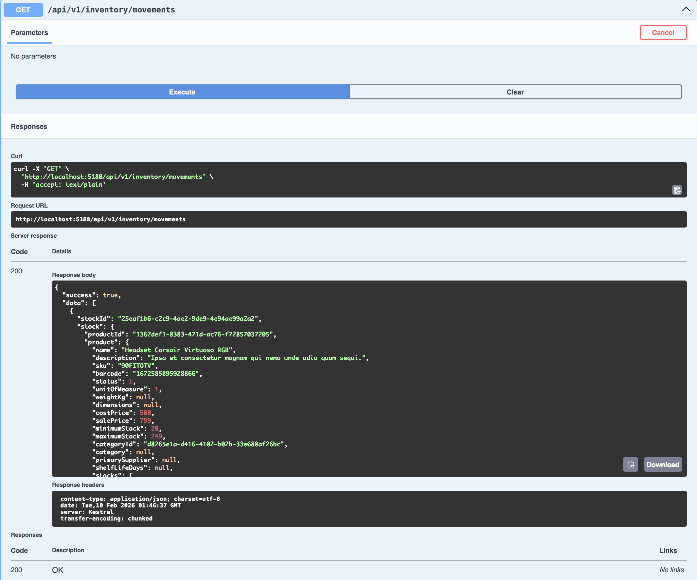
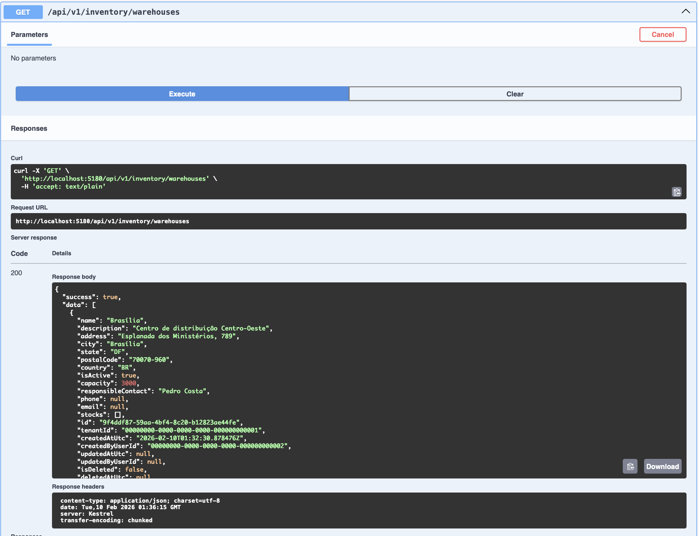
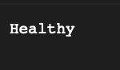

# 📦 Sysotto.Inventory - Showcase

[](https://dotnet.microsoft.com)  
[](https://docs.microsoft.com/en-us/dotnet/csharp/)  
[](https://www.postgresql.org/)  
[](#)  

> **Módulo de gestão de inventário e estoque para .NET 10**  
> 
> Sistema completo de **Stock Management** em produção, distribuído como pacote NuGet modular.
> Implementa padrões enterprise (Clean Architecture, CQRS, DDD), multi-tenancy com RLS, rastreabilidade completa e conformidade LGPD.

## 🛠️ Stack Tecnológico

**Framework & Linguagem:**
- `.NET 10.0` - Framework principal
- `C# 14` - Linguagem moderna com recursos avançados

**Banco de Dados:**
- `PostgreSQL 17` - Database relacional robusto
- `Entity Framework Core 10.0.0` - ORM para abstração de dados

**Autenticação & Integração:**
- `Sysotto.Identity` - Integração com módulo de identidade
- `JWT (JSON Web Tokens)` - Segurança entre módulos
- `HttpClientFactory` - Comunicação resiliente entre serviços

**Cache & Performance:**
- `Redis 7.2` - Cache distribuído de saldos
- `StackExchange.Redis 2.10.1` - Driver Redis

**Logging & Observabilidade:**
- `Serilog 4.3.0` - Structured logging com contexto (TenantId, UserId, CorrelationId)
- `Serilog.AspNetCore 9.0.0` - Integração com ASP.NET Core
- `Health Checks` - Monitoramento de dependências

**Validação & Qualidade:**
- `FluentValidation 12.1.1` - Validação de dados em múltiplas camadas
- `xUnit` - Framework de testes unitários
- `Testcontainers` - Testes de integração com PostgreSQL

**API & Documentação:**
- `Swagger/OpenAPI` - Documentação interativa de APIs
- `API Versioning` - Controle de versão de endpoints

**Padrões & Messaging:**
- `MediatR` - CQRS pattern (Commands & Queries)
- `FluentResults` - Result pattern para tratamento de erros

## 📸 Screenshots

### 1. Listagem e Filtro de Produtos


### 2. Dashboard de Estoque


### 3. Movimentações de Estoque


### 4. Gestão Multi-Armazém


## 📁 Estrutura do Projeto

A arquitetura segue **Clean Architecture** com 4 módulos independentes:

```
Sysotto.Inventory/
├── src/
│   ├── Sysotto.Inventory.Core/
│   │   ├── CORE_README.md          ◄─ Documentação da camada Core
│   │   ├── Entities/    (Product, Category, Warehouse, Stock, StockMovement)
│   │   ├── Enums/       (MovementType, StockStatus, etc)
│   │   ├── Interfaces/  (IProductRepository, IStockService, etc)
│   │   └── ValueObjects/ (SKU, Barcode, Quantity)
│   │
│   ├── Sysotto.Inventory.Infrastructure/
│   │   ├── INFRA_README.md        ◄─ Documentação da camada Infrastructure
│   │   ├── Data/        (InventoryDbContext, Migrations)
│   │   ├── Repositories/ (ProductRepository, StockRepository, etc)
│   │   └── Services/    (StockService, MovementService, WarehouseService, etc)
│   │
│   ├── Sysotto.Inventory.Api/
│   │   ├── API_README.md           ◄─ Documentação da camada Api
│   │   ├── Controllers/ (ProductsController, StockController, MovementsController, etc)
│   │   ├── Dtos/        (CreateProductRequest, StockResponse, MovementResponse, etc)
│   │   ├── Filters/     (ExceptionFilter, ValidateModelFilter)
│   │   └── Middleware/  (TenantResolution, Logging)
│   │
│   └── Sysotto.Inventory.Client/
│       ├── CLIENT_README.md       ◄─ Documentação do SDK Client
│       ├── InventoryApiClient.cs
│       └── Dtos/
│
├── tests/
│   ├── Sysotto.Inventory.UnitTests/
│   ├── Sysotto.Inventory.IntegrationTests/ (com Testcontainers)
│   └── ...
│
├── docs/
│   └── ai/          (Arquitetura técnica detalhada)
│
├── .github/
│   └── workflows/
│       ├── ci-cd.yml       (Build + Testes)
│       └── publish.yml     (Publicar pacotes NuGet via tags)
│
├── nupkg/           (Armazena pacotes .nupkg e .snupkg)
├── docker-compose.yml (Stack completo: API + PostgreSQL + Redis)
└── Sysotto.Inventory.slnx
```

**Cada módulo é independente e pode ser usado isoladamente ou integrado com Identity.**

## 🔑 Funcionalidades Principais

### Gestão de Produtos
✅ CRUD completo de produtos com versionamento  
✅ Categorias hierárquicas  
✅ SKU único por tenant  
✅ Código de barras (EAN-13)  
✅ Preços com histórico de alterações  

### Gestão de Estoque
✅ Saldo agregado por produto + armazém  
✅ Reservas e alocações  
✅ Níveis críticos com alertas  
✅ Rastreamento de lotes  
✅ Validade de produtos (FIFO/LIFO)  

### Movimentações
✅ Entradas (compras, devoluções)  
✅ Saídas (vendas, ajustes)  
✅ Transferências entre armazéns  
✅ Ajustes de inventário  
✅ Histórico completo com auditoria  

### Multi-Tenancy & Isolamento
✅ Isolamento completo de dados via `TenantId`  
✅ PostgreSQL RLS como camada adicional  
✅ Permissões por tenant  
✅ Relatórios segregados  

### Observabilidade
✅ Auditoria de todas as operações  
✅ Logs estruturados com correlação  
✅ Health checks para dependências  
✅ Métricas de performance  

## 🏗️ Arquitetura & Padrões de Design

**Clean Architecture** com responsabilidades bem separadas:

```
CLIENT APPLICATIONS
        ↓
    HTTP
        ↓
┌────────────────────────────────┐
│  API (Controllers, DTOs)       │ ← Endpoints, Middleware, Filters
└────────────────────────────────┘
        ↓ Depende de
┌────────────────────────────────┐
│ INFRASTRUCTURE (EF, Services)  │ ← Persistência, integração
└────────────────────────────────┘
        ↓ Depende de
┌────────────────────────────────┐
│ CORE (Entities, VOs, Regras)   │ ← Lógica de negócio pura
└────────────────────────────────┘
```

**Padrões Implementados:**
- 🎯 **SOLID Principles** - Responsabilidade única e bem definida
- 🛡️ **Domain-Driven Design** - Modelo enriquecido com regras de negócio
- 🔄 **CQRS Pattern** - Separação de Commands (escrita) e Queries (leitura)
- 🔗 **Repository Pattern** - Abstração completa de acesso a dados
- 📊 **Unit of Work** - Transações atômicas multi-operação
- ⚡ **Result Pattern** - Erros como valores, não exceções
- 🔐 **Dependency Injection** - Inversão de controle nativa

## 🧪 Qualidade & Testes

- ✅ **70+ Testes** Unit + Integration passando
- ✅ **PostgreSQL via Testcontainers** - Testes isolados e reproduzíveis
- ✅ **FluentValidation** - Validação em múltiplas camadas (Commands, DTOs)
- ✅ **Architecture Tests** - Garantia de Clean Architecture
- ✅ **Code Analysis** - StyleCop e análise estática

### Resultado dos Testes
```
✅ 37 Testes Unitários    - 31 ms
✅ 33 Testes de Integração - 22 s
━━━━━━━━━━━━━━━━━━━━━━━━━━━━━━
   70 Testes Passando 100%
```


### Health Checks & Observabilidade
```
GET /health/ready → Healthy ✅  (Pronto para requisições)
GET /health/live  → Healthy ✅  (Aplicação viva)

Status: Operacional com todas as dependências ok
Logging: Serilog com Structured Logging (TenantId, UserId, CorrelationId)
Monitoring: Pronto para integração com Prometheus + Grafana
```



## 📦 Distribuição como NuGet

```bash
# Core (Entidades, interfaces, value objects)
dotnet add package Sysotto.Inventory.Core

# Infrastructure (EF Core, repos, services)
dotnet add package Sysotto.Inventory.Infrastructure

# API (Controllers, middleware, DTOs)
dotnet add package Sysotto.Inventory.Api

# Client (SDK para consumo da API)
dotnet add package Sysotto.Inventory.Client
```

## 💡 Por Que Este Projeto Impressiona

Este projeto demonstra competências fundamentais para desenvolvimento enterprise:

1. **Gestão de Complexidade** - Controle de estoque é problema complexo (reservas, transações, múltiplos armazéns)
2. **Integrações Reais** - Integração com módulo de Identity, rastreamento de usuários
3. **Dados Críticos** - Implementação de auditoria, histórico e reconciliação
4. **Performance em Escala** - Cache Redis, índices no PostgreSQL, queries otimizadas (52 MB → 15 KB)
5. **Rastreabilidade Completa** - Cada movimento auditado, imutável, com timestamp
6. **Multi-tenancy Real** - Isolamento via DB + RLS, não apenas filtros em código
7. **Conformidade LGPD** - Anonimização, retenção de dados, direito ao esquecimento
8. **Testes de Integração** - Validação com banco de dados real via Testcontainers

### 🎯 Para Recrutadores

Este projeto evidencia:

**Qualidade de Código:**
- ✅ 70+ testes automatizados (unit + integration)
- ✅ Cobertura de testes em todas as camadas
- ✅ TDD mindset com Testcontainers para testes realistas

**Produção Ready:**
- ✅ Health checks implementados (readiness + liveness)
- ✅ Structured logging com correlação
- ✅ Observabilidade nativa (pronto para Prometheus/Grafana)
- ✅ Tratamento robusto de erros

**Otimizações:**
- ✅ Queries otimizadas (redução de 3.480x no payload)
- ✅ AsNoTracking() para leitura
- ✅ Paginação e lazy loading estratégico
- ✅ Caching com Redis

**Segurança:**
- ✅ Multi-tenancy com isolamento real
- ✅ Autenticação e autorização integradas
- ✅ Validação em múltiplas camadas
- ✅ Rastreamento completo de auditoria

## 🔄 Integração com Sysotto.Identity

O módulo **Inventory** integra-se perfeitamente com **Identity**:

- ✅ Validação de usuários via JWT
- ✅ Auditoria com rastreamento de `UserId`
- ✅ Autorização baseada em roles/claims
- ✅ Multi-tenancy sincronizada
- ✅ Logging correlado entre módulos

## 👨‍💻 Sobre o Desenvolvedor

**Otto Freitag**  
Desenvolvedor Full-Stack .NET com especialização em:
- Gestão de dados e integrações complexas
- Arquitetura de software e padrões de design
- Sistemas distribuídos com escalabilidade horizontal
- Segurança de aplicações e conformidade regulatória

[](https://github.com/OttoF77)

---

**Projeto Privado** - Todos os direitos reservados © 2025-2026
